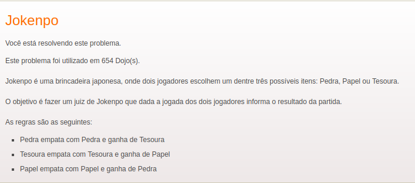

## Dojo Jokenpo

Aplicação CMD | Dojo Jokenpo

<b> Iniciar a aplicação </b>  

- 1º Git clone;  
- 2º Via cmd, pasta raiz do projeto e execução dos seguintes comandos:  
  `npm install`  
  `node index`;
- 3º Aguardar inicio da aplicação e jogar.

<b> Sobre a aplicação </b>  

Resolução CMD para o Dojo proposto de uma aplicação que objetiva a indicação de um vencedor ao jogar Jokenpo. Atendendo os seguintes requesitos:

Ao iniciar a aplicação no CMD com o seguinte comando:

`node index`

Será perguntado qual o modo de jogo: Player X Player ou Player X Machine.  
Ao escolher o modo, o player 01 faz a jogado e consecutivamente o player02 ou a máquina.  
Ao fim, o juiz indica quais foram as jogadas, se houve vencedor ou occoreu um empate.

Realizado por: Vinicius Simone Martins
